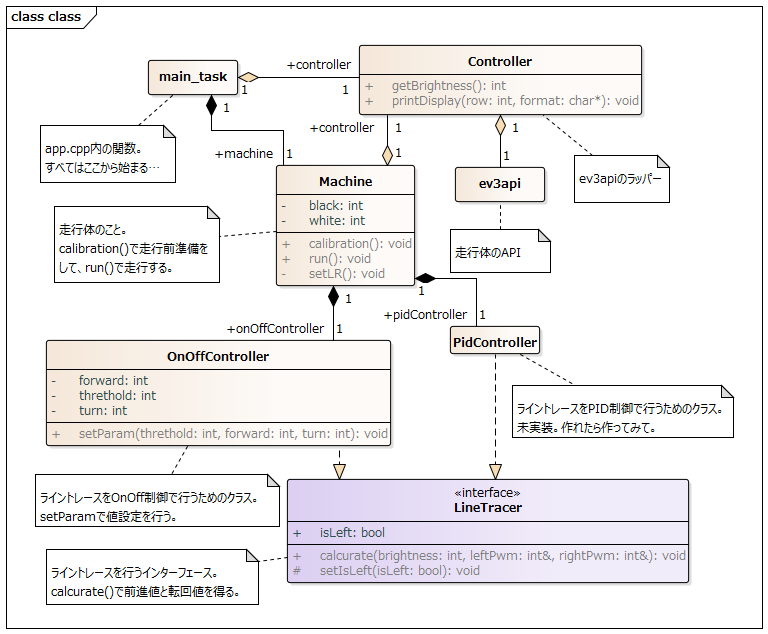

# hackev_on_off_linetrace
In this repository, we are developing an educational program for LEGO Mindstorm using EV3RT.
The running body is assumed to be HackEV.

## Usage
In the workspace, type the following command.

```
docker run --rm -it -v $PWD:/home/hrp2/sdk/workspace/product korosuke613/etrobo-docker
```

or

```
./make_docker.sh
```

An executable file named "app" is created.

```
ls
LICENSE      Makefile.inc README.md    app          app.cfg      app.cpp      app.h      apps
```

## Class Diagram


## Use Remote Container for VSCODE
You can use Remote Container.

Reference: https://tech.actindi.net/2019/06/18/085723
